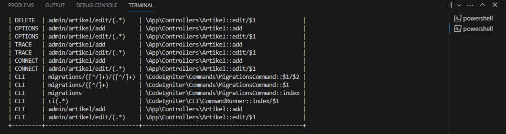
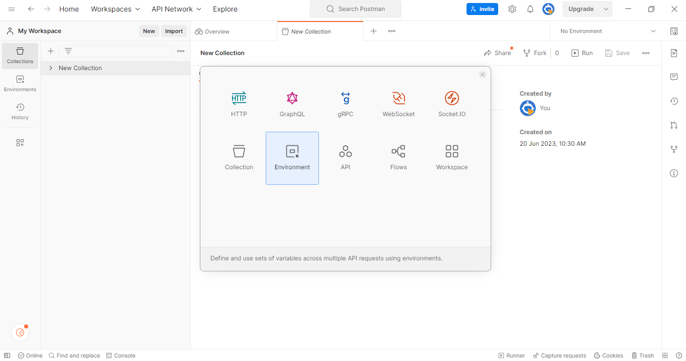
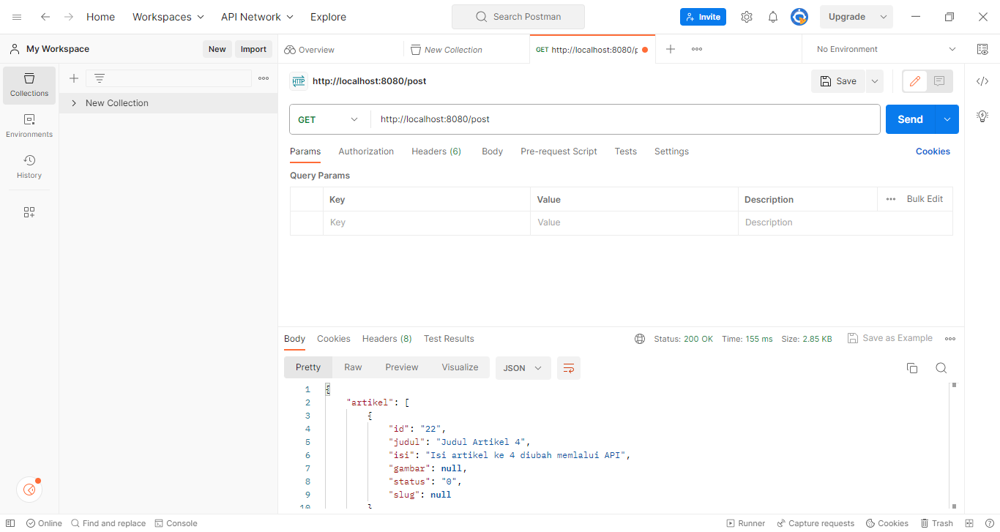
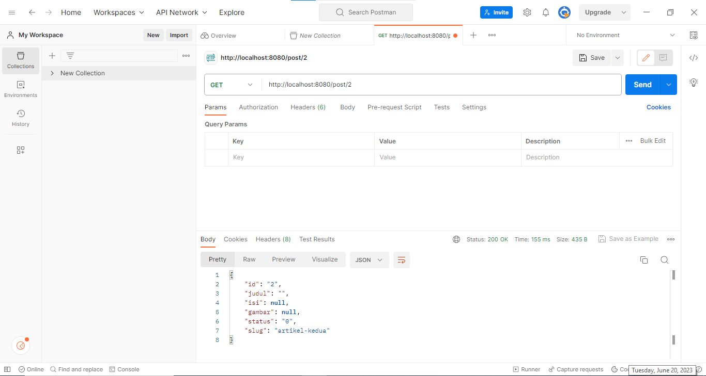
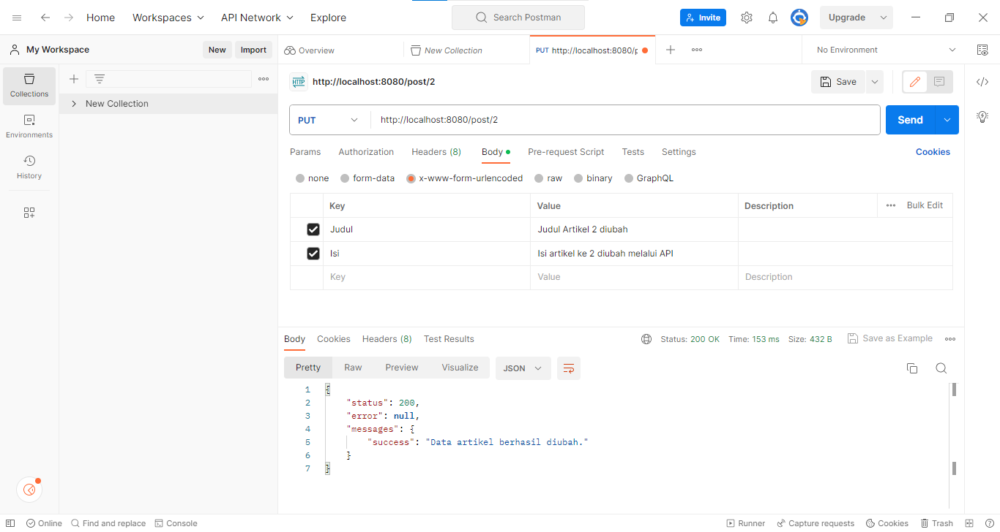
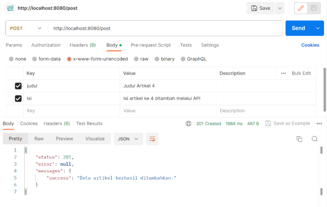
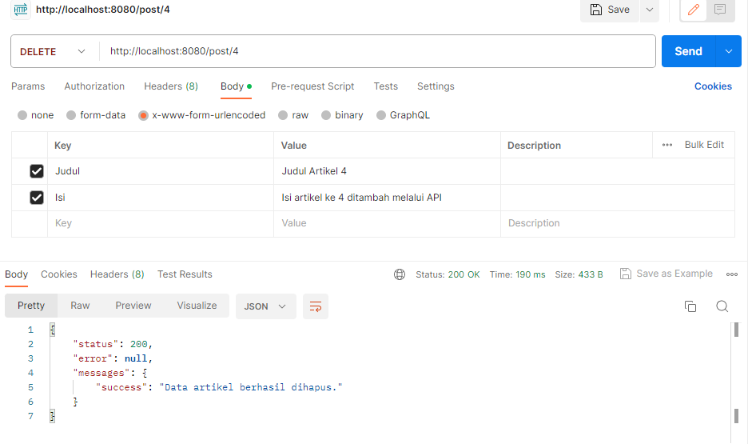

# Tugas Pemrograman Web 2
# Praktikum 12
## Profile
<body>
    <table border="1">
        <tr>
            <th> Nama</th>
            <th>NIM</th>
            <th>Kelas</th>
        </tr>
        <tr>
            <td>Rezza Fauzi Caesar</td>
            <td>312110133</td>
            <td>TI.21.A.1</td>
        </tr>
    </table>
</body>

## Instructions
- Melanjutkan praktikum sebelumnya pada repository dengan nama Lab11Web.
- Kerjakan semua latihan yang diberikan sesuai urutannya.
- Screenshot setiap perubahannya.
- Update file README.md dan tuliskan penjelasan dari setiap langkah praktikum beserta screenshotnya.
- Commit hasilnya pada repository masing-masing.
- Kirim URL repository pada e-learning ecampus

## Step By Step
***Periapan awal adalah mengunduh aplikasi REST Client, ada banyak aplikasi yang dapat digunakan untuk keperluan tersebut. Salah satunya adalah Postman. Postman – Merupakan aplikasi yang berfungsi sebagai REST Client, digunakan untuk testing REST API. Unduh apliasi Postman dari tautan berikut: https://www.postman.com/downloads/***

## Buat Models
Pada modul sebelumnya sudah dibuat ArtikelModel, pada modul ini kita akan memanfaatkan model tersebut agar dapat diakses melalui API.

## Buat REST Controller
Pada tahap ini, kita akan membuat file REST Controller yang berisi fungsi untuk menampilkan, menambah, mengubah dan menghapus data. Masuklah ke direktori app\Controllers dan buatlah file baru bernama Post.php. Kemudian, salin kode di bawah ini ke dalam file tersebut:

```
<?php
namespace App\Controllers;
use CodeIgniter\RESTful\ResourceController;
use CodeIgniter\API\ResponseTrait;
use App\Models\ArtikelModel;
class Post extends ResourceController
{
use ResponseTrait;
// all users
public function index()
{
$model = new ArtikelModel();
$data['artikel'] = $model->orderBy('id', 'DESC')->findAll();
return $this->respond($data);
}
// create
public function create()
{
$model = new ArtikelModel();
$data = [
'judul' => $this->request->getVar('judul'),
'isi' => $this->request->getVar('isi'),
];
$model->insert($data);
$response = [
'status' => 201,
'error' => null,
'messages' => [
'success' => 'Data artikel berhasil ditambahkan.'
]
];
return $this->respondCreated($response);
}
// single user
public function show($id = null)
{
$model = new ArtikelModel();
$data = $model->where('id', $id)->first();
if ($data) {
return $this->respond($data);
} else {
return $this->failNotFound('Data tidak ditemukan.');
}
}
// update
public function update($id = null)
{
$model = new ArtikelModel();
$id = $this->request->getVar('id');
$data = [
'judul' => $this->request->getVar('judul'),
'isi' => $this->request->getVar('isi'),
];
$model->update($id, $data);
$response = [
'status' => 200,
'error' => null,
'messages' => [
'success' => 'Data artikel berhasil diubah.'
]
];
return $this->respond($response);
}
// delete
public function delete($id = null)
{
$model = new ArtikelModel();
$data = $model->where('id', $id)->delete($id);
if ($data) {
$model->delete($id);
$response = [
'status' => 200,
'error' => null,
'messages' => [
'success' => 'Data artikel berhasil dihapus.'
]
];
return $this->respondDeleted($response);
} else {
return $this->failNotFound('Data tidak ditemukan.');
}
}
}

```

Kode diatas berisi 5 method, yaitu:
1. index() – Berfungsi untuk menampilkan seluruh data pada database.
2. create() – Berfungsi untuk menambahkan data baru ke database.
3. show() – Berfungsi untuk menampilkan suatu data spesifik dari database.
4. update() – Berfungsi untuk mengubah suatu data pada database.
5. delete() – Berfungsi untuk menghapus data dari database.

## Buat Routing REST API
Untuk mengakses REST API CodeIgniter, kita perlu mendefinisikan route-nya terlebih dulu. Dengan cara masuk ke direktori app/Config dan buka file Routes.php. Tambahkan kode berikut:

```
$routes->resource('post');
```

- Untuk mengecek route nya jalankan perintah berikut :

```
php spark routes
```

- Selanjutnya akan muncul daftar route yang telah dibuat.


Seperti yang terlihat, satu baris kode routes yang di tambahkan akan menghasilkan banyak Endpoint.

Selanjutnya melakukan uji coba terhadap REST API CodeIgniter.

## Testing REST API CodeIgniter
Buka aplikasi postman dan pilih create new → HTTP Request.



## Displays All Data
Pilih method GET dan masukkan URL berikut :
- http://localhost:8080/post

Kemudian, klik Send. Jika hasil test menampilkan semua data artikel dari database maka pengujian berhasil.



## Display Certain Data
Masih bersama method GET yaa, disini hanya perlu menambahkan ID artikel di belakang URL berikut :
- http://localhost:8080/post/2

Selanjutnya, klik Send. Request tersebut akan menampilkan data artikel yang memiliki ID nomor 2 di database.



## Ubah Data
Untuk mengubah data, silakan ganti method menjadi PUT. Kemudian, masukkan URL artikel
yang ingin diubah. Misalnya, ingin mengubah data artikel dengan ID nomor 2, maka masukkan URL berikut :
- http://localhost:8080/post/2

Selanjutnya, pilih Tab Body. Kemudian, pilih x-www-form-uriencoded. Masukkan nama 
atribut tabel pada kolom KEY dan nilai data yang baru pada kolom VALUE. Jika sudah klik Send.
 


## Menambahkan Data
Kita perlu menggunakan method POST untuk menambahkan data baru ke database. 
Kemudian, masukkan URL berikut :
- http://localhost:8080/post

Pilih tab Body, lalu pilih x-www-form-uriencoded. Masukkan atribut tabel pada 
kolom KEY dan nilai data baru di kolom VALUE. Jangan lupa, klik Send.


 
## Menghapus Data

Pilih method DELETE untuk menghapus data. Lalu, masukkan URL spesifik data mana yang 
ingin di hapus. Misalnya, ingin menghapus data nomor 4, maka URL-nya seperti ini :
- http://localhost:8080/post/7

Langsung saja klik Send, maka akan mendapatkan pesan bahwa data telah berhasil dihapus dari database.


  
## Thank YOU
